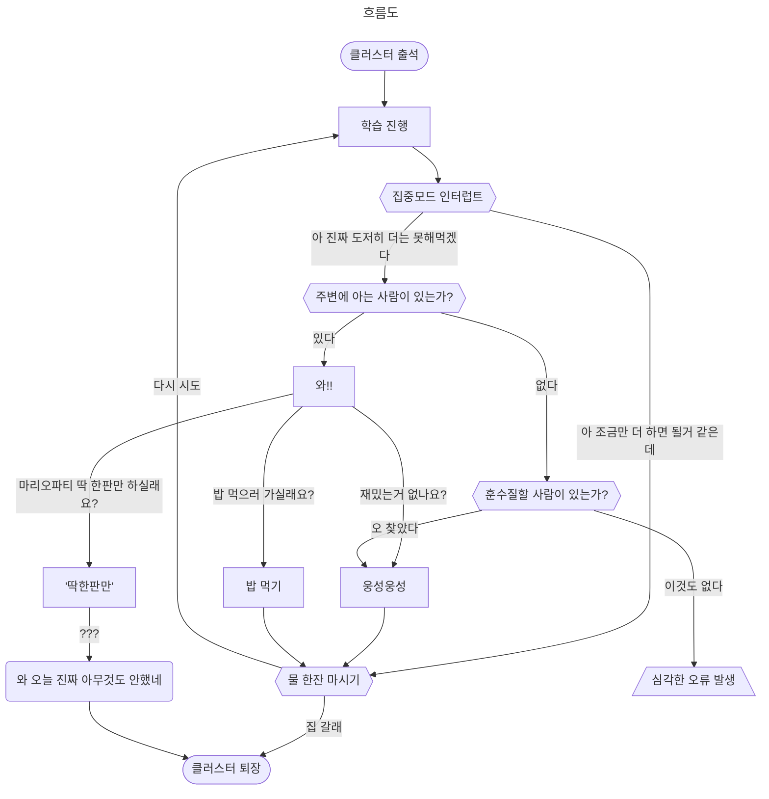

# [ultrayellow](https://github.com/ultrayellow)

<details open>
<summary></summary>

42에서 학습을 진행하다보면 항상 일관되게 과제나 평가를 하고 앉아있기는 몹시 어려운 일이다.
주변의 동료들과 자잘한 일상 속의 이야기를 나누면서 피로한 뇌를 쉬게 해주어야 한다.
아니면 물론 개포 클러스터의 1층에 내려가서 마리오카트나 마리오파티를 하는 것도 좋다.

그런데, 가끔은 나랑 같이 놀아주는 <sub>고마운</sub> 동료가 바쁘거나 부재중인 경우도 있을 것이다.
이럴 때는 시무룩할것이 아니라 클러스터를 떠돌아다닌다.
그런 다음에 아무에게나 갑작스럽게 끼어들어 훈수질이라도 해야한다.

그런데, 최악의 경우 이렇다 할 일 마저도 없는 날이 생각보다 빈번하게 찾아온다.



그렇다. `심각한 오류`가 발생하는 것이다. 그렇다고 해서 다시 `학습 진행`으로 되돌아갈 수는 없다. 왜냐하면 이미 `아 진짜 도저히 더는 못해먹겠다`를 선언하고 나왔기 때문이다.

그런데 또 막상 다른 할 것이 있지도 않다. 평소에 대인 관계를 더 잘 해둘걸 하면서 결국 다시 자리에 앉아서 컴퓨터를 켜야한다.

그러나 여전히 심심하다[^1]. 그래서 원래 하던 것과 다른, 조금 더 재미있을 것 같다고 생각되는, 새로운 프로젝트를 만든다. 지금까지는 이렇게 만들어진 프로젝트들 모두 앉았던 자리의 *goinfre*에서 스러졌다.

[^1]: 해야 하는 것은 많은데, 그중에는 하고 싶은 것이 없다.

개중에는 간혹 재미있는 프로젝트도 있었지만, 만들 당시에는 저장해야할 가치까지는 느끼지 못했기 때문에 소실되었고, 이제는 찾을 수 없다. 계속해서 비슷한 아쉬움이 남는 것을 느꼈기에 이제부터라도 그렇게 만들던 프로젝트들만 모아두는 곳이 필요했고, 그렇게 만든게 바로 이 **ultrayellow**다.

</details>

## [ft-api-requester](https://github.com/ultrayellow/ft-api-requester)
### 상태
:yellow_circle: 부분 사용 가능
1. :small_blue_diamond: 기본적인 rate limit 관리 구현
1. :small_orange_diamond: retry 로직 미구현
1. :small_orange_diamond: validation 로직 미구현

<details>
<summary>더 보기</summary>

### 의도
- 42 인트라 api로 rate limit을 준수하며 요청을 빠르고 편하게 보낼 수 있도록 한다.

### 목표
- type 안정성을 보장한다.
- strict eslint를 충족시킨다.
- 요청을 효율적으로 보내면서 실패율을 최소화한다.

</details>

## [shared_ptr](https://github.com/ultrayellow/shared_ptr)
### 상태
:green_circle: 사용 가능 (라이브러리)
<details>
<summary>더 보기</summary>

### 의도
- new와 delete 키워드 없이도 메모리 동적 할당을 한다.
- RAII를 응용하여 안전하게 할당된 메모리를 해제한다.
- 궁극적으로 얕은 수준의 GC를 구현하여 비교적 쉽게 메모리를 관리한다.

### 예시
아래 코드에서는 메모리 누수가 일어나지 않는다.

<details><summary>코드</summary>

```C++
#include "uy_shared_ptr.hpp"

#include <iostream>

struct X
{
    int value;
};

struct A
{
    int value;
    X x;
};

void foo(uy::shared_ptr<void> p_void);

int main()
{
    // make
    uy::shared_ptr<A> p_a = uy::make_shared<A>();
    p_a->value = 4;

    // alias
    uy::shared_ptr<X> p_x(p_a, &p_a->x);
    p_x->value = 2;

    std::cout << p_a->value << std::endl;
    std::cout << p_a->x.value << std::endl;
    std::cout << p_x->value << std::endl;

    foo(p_a);

    return 0;
}

// void type
void foo(uy::shared_ptr<void> p_void)
{
    // type casting
    uy::shared_ptr<A> p_a = uy::static_pointer_cast<A>(p_void);

    std::cout << p_a->value << std::endl;
    std::cout << p_a->x.value << std::endl;
}
```

</details>

### 목표
- C++11의 스마트포인터 `std::shared_ptr<T>`의 모방 구현체다.
- 단순하게 만들어서 다른 곳에서 라이브러리처럼 사용하기 위해서 만들었다.
- 코드가 너무 많아지면 다른 사람이 가볍게 읽기 어려우므로 최대한 이를 피했다.
- 표준을 모두 따르면 복잡해지기 때문에 이 프로젝트에서는 그러지 않았다.
- 아래에 명시된 미구현은 모두 의도된 것이지만, 명시되지 않은 것은 실수다.
	- 실수로 추정되는 부분을 발견하시면 이슈로 등록해주세요.

| 기능                                   | `uy::shared_ptr<T>` 구현 |
| :---                                  | :---: |
| :white_check_mark: shared_ptr         | 공유 참조 있음 |
| :white_check_mark: alias shared_ptr   | 별칭 포인터 가능 |
| :white_check_mark: casting shared_ptr | 형식 변환 가능 |
| :white_check_mark: shared_ptr\<void\> | void 타입 지원 |
| :x: weak_ptr                          | 약한 참조 없음 |
| :x: enable_shared_from_this           | 공유 소유권 미지원 |
| :x: atomic counted                    | 원자적 카운트 안함 |
| :x: alloc_shared                      | 사용자지정 allocator 미지원 |
| :x: deleter                           | 사용자지정 deleter 미지원 |
| :x: contiguous counted                | 컨트롤 블록 연속성 없음 |
| :x: (C++17, C++20) array type         | 배열 타입 미지원 |

</details>

## [magic-conch](https://github.com/ultrayellow/magic-conch)

> 마법의 소라고동

### 상태
:yellow_circle: 부분 사용 가능
1. :small_blue_diamond: 42 보너스 수준의 파싱 완료
1. :small_blue_diamond: `echo 123 | cat -e` 정도의 파이프라인 명령 실행 가능
1. :small_orange_diamond: 조건 리스트 (||, &&), 서브셸 미구현
1. :small_orange_diamond: 환경변수 변경 미구현
1. :small_orange_diamond: expansion (quote, \$USER, \$? 등) 미구현
1. :small_orange_diamond: glob (\*) 미구현

<details>
<summary>더 보기</summary>

### 의도
- 42의 과제 minishell에 대한 이해도를 충분히 높이기 위해서 시작했다.

### 목표
- 42의 minishell을 Mandatory part와 Bonus part에 대해서 구현하는 것이다.
- C++이 아직 미숙하여 연습을 겸할 수 있도록 C가 아닌 C++98/03를 선택하였다.
- C가 아니므로 norminette도 지키지 않는다. 코드도 굳이 깔끔함을 신경쓰진 않을 것이다.
- 이번에는 LR 구문분석이 아닌, 최대한 직관적이게 재귀 하향식 구문분석을 사용한다.
- 커맨드 타입의 구분을 union이 아닌 상속으로 구현한다.
- 문자열의 조작에 대해서 `std::string`을 최대한 활용해본다.

### 기타
- 최초의 프로젝트 이름은 "microshellxx"이었다.
	- minishell보다 대충 만든 더 작은 microshell이라는 뜻으로.
	- 그리고 C++의 또 다른 표현 CXX에서 xx를 따왔다.
- 문자열은 `std::string`, 동적 배열은 `std::vector<T>`로 안전하게 사용할 수 있다.
- 하지만 다른 객체는 그럴 수가 없었기에 `uy::shared_ptr<T>`를 만드는 계기가 되었다.
- norminette도 없고, C++의 스탠다드 라이브러리를 잘만 활용하면 쉬울줄 알았다.
- **그러나 다시 한번 느꼈는데, 미니셸은 결코 만만한 과제가 아니다.** 다시는 미니셸을 얕보지 마라.

</details>

## [cowardly-excuse](https://github.com/ultrayellow/cowardly-excuse)

> 비겁한 자를 위한 변명

### 상태
:red_circle: 기반 기능만 동작
1. :small_blue_diamond: select()를 통한 통지 이벤트 처리
1. :small_blue_diamond: 서버와 유저를 상속 구조로 통합
1. :small_blue_diamond: 바이트 버퍼를 CR-LF로 줄 구분
1. :small_blue_diamond: IRC 메시지 규격 파싱
1. :small_blue_diamond: 방 만들기, 입장, 퇴장, 삭제, 브로드캐스팅
1. :small_orange_diamond: IRC 요청에 따른 처리 및 응답
1. :small_orange_diamond: `nc -C localhost`로 접속해서 테스트하지 않는 이상 IRC로서의 동작은 불가능함.

<details>
<summary>더 보기</summary>

### 의도
- 42의 팀 과제 ft_irc를 진행하기에 앞서서 선행 기반 지식을 만들기 위하여 시작했다.

### 목표
- 서버 라이브러리를 만들기 위해 필요한 요소를 실습을 통해 체감한다.
	- 어떻게 만들면 편하겠다.
	- 이렇게 만들면 동작 못하겠다.
	- 등등...
- 본 과제를 멀티스레디드 서버로 만들겠다고 큰소리치고 다녔는데 벌써부터 머리가 지끈거린다.
- 이 프로젝트는 놀이터이자 마음의 안식처이므로 싱글스레디드로 만들 것이다.
- 혹자는 이에 대해 '혹시 슈퍼 겁쟁이신가요?'라는 평을 남겼다.

</details>

### 계획 중

<details>
<summary>더 보기</summary>

## mlx_pushpush

### 상태
:black_circle: 계획중, 시작 안함

## mlx_minesweeper

### 상태
:black_circle: 계획중, 시작 안함

</details>
